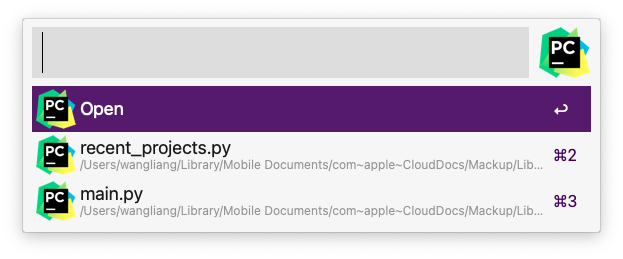
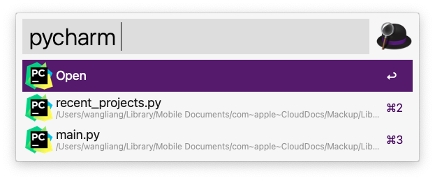

## @liangshen/alfred-pycharm

*Alfred工作流，快速启动PyCharm软件中打开过的项目*
*Alfred workflow for PyCharm*

### 运行环境

* Nodejs 14.x.x
* Alfred Powerpack
* PyCharm

### 安装

```
npm i -g @liangshen/alfred-pycharm
```

### 使用方法

可使用 option + P 快捷键调出PyCharm工作流搜索框(或者调出alfred搜索框输入关键字 pycharm)

回车可使用PyCharm打开项目, 按住Command键回车可在Finder中打开项目




